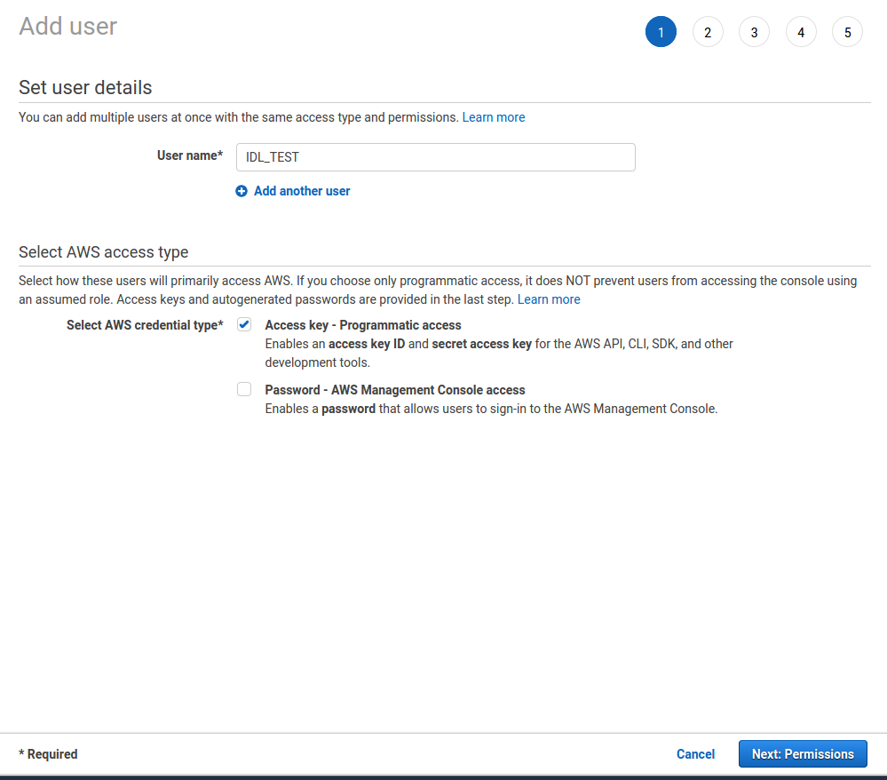
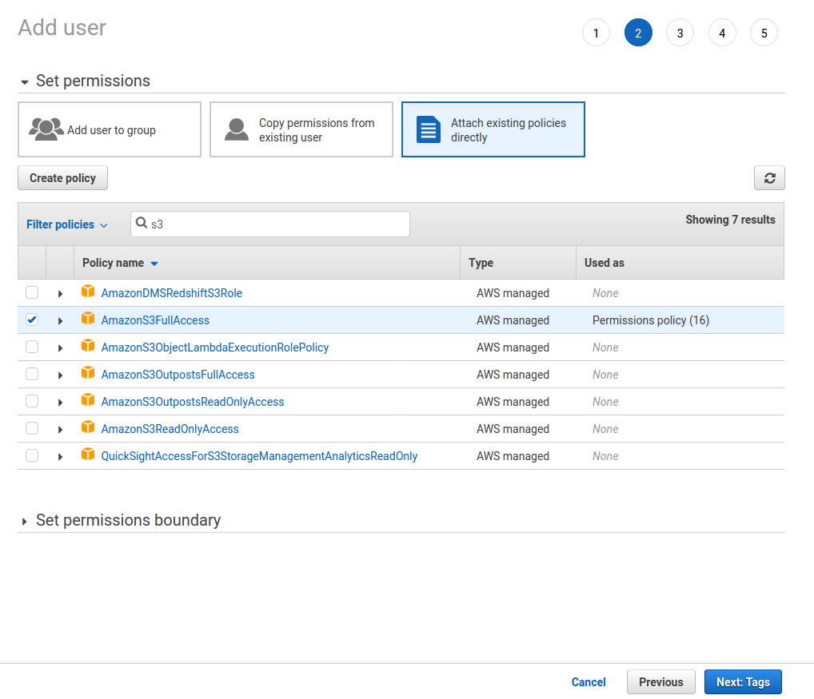
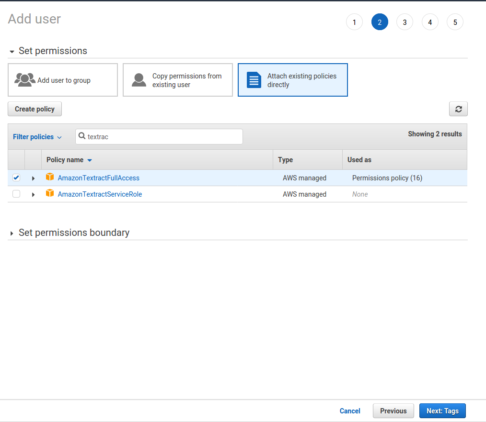

# Industry Document Library 
Welcome! This repository contains the code to obtain the OCR annotations of 
Industry Document Library (IDL) located in https://www.industrydocuments.ucsf.edu/.

We exclusively used the Amazon's OCR engine Textract to get the OCR annotations. 
We will explain in-depth how we use Textract and parallize to get annotations for **21 Million pages**.
But first dependencies/requirements:
```text
botocore==1.23.10
boto3==1.20.10
joblib==1.0.0
tqdm==4.61.0
```
All the code is run with python 3.7.9.


## Preliminaries
<ul>
  <li>You need to have an AWS account on https://aws.amazon.com/.</li>
  <li>You need to have the root account to create IAM users, more details later.</li>
  <li>At some point, you may want to ask for limit increase for Textract by contacting support 
since otherwise it will be arduously slow.</li>
</ul> 

### Understanding Hard Limits of Amazon
Textract works with synchronous and asynchronous operations. 
We will be using the asynchronous one which means that you can give all the documents to Textract, 
and when Textract finishes all the processes, you can download it. 

First hard limit is 3000 pages for document.
Second hard limit is transactions per second per account for all get (asynchronous) operations which is 10 by default.
And maximum number of asynchronous jobs per account that can simultaneously exist is 600.

More about the hard limits in [here](https://docs.aws.amazon.com/textract/latest/dg/limits.html)
and [here](https://docs.aws.amazon.com/general/latest/gr/textract.html).


## Getting the Data
### Download Raw PDFs
IDL has a somewhat unorthodox file structure. We keep this structure also in our annotations.
```
f/
|-f/f/
|--f/f/b
|---f/f/b/b
...
```
Each folder has 16 folders inside and 4 depth and at the final depth usually around ~220 pdfs.
You can check the folder structure from AWS in [here.](https://s3.console.aws.amazon.com/s3/buckets/edu.ucsf.industrydocuments.artifacts?region=us-west-2)

Now, we download the IDL documents to our local drive even though we only give point the S3 location when we use Textract.
Reasons are as follows.
<ul>
<li>There are some empty or invalid or corrupted documents. We want to identify those before giving it to Textract.</li>
<li>There are some documents that has more than 3000 pages which makes the Textract hang forever.
</li>
</ul>>

So to download the data of IDL, you can run the command:
```bash
aws s3 cp s3://edu.ucsf.industrydocuments.artifacts [PATH_TO_SAVE] --recursive
```
You can also specify the specific folder to download by changing into
`s3://edu.ucsf.industrydocuments.artifacts/f` or `s3://edu.ucsf.industrydocuments.artifacts/g/h`.
You get the idea!

### Cleaning
Now, we are done with the preliminaries and know about the hard limits and downloaded the pdfs, 
let's get to work.

First, as mentioned above we need to some cleaning. 
We check for corrupted files and move them (you need to change the ROOT and OUT in check_pdf_corrupted.py, sorry I am lazy):
```bash
python check_pdf_corrupted.py
```
Then we find all the big files if they have more than 3000 pages, 
```bash
find ./IDL/ -type f -size +50M -name "*.pdf" > ./big_files.txt
```
and run (by changing the path information inside the file.)
```bash
python move_big_files.py
```

### Running Textract
Now that we more or less cleaned the data, we need to run Textract. 
Because of the hard limits we mentioned, we need to circumvent that by creating IAM users in AWS. 

You sign-in to AWS with your account, go to IAM page and click Users in the left panel. 
Then, click on the Add users. 
Put in the username, check the box on Access key - Programmatic access, click Next.



Then you need to give AmazonS3FullAccess and AmazonTextractFullAccess to these accounts.

S3 Permission           |  Textract Permission
:-------------------------:|:-------------------------:
| 

Then click Next and Review and Create user. 
Once you have the user, it will give  Access key ID and Secret access key. 
Save them and put them inside the `KEYS` variable in `run_textract.py`.
Since `KEYS` is a list of tuple, first element of tuple should be Access key ID and the second element Secret access key

**NOW, DO THIS 16 TIMES!** No, I am not kidding. 
Since we want to parallelize all the process, we have to create 16 IAM users, one user for each core.
Or do it according to how many cores you want to run this process. 
And then, well, you know it already:
```bash
python run_textract.py
```

PS: If at any point, something happens and the code stops (which is bound to happen), 
fear not, just run the command again, and it will skip all the files it already processed.

## Download the Data
Well, we all know why you are here, it is certainly not the RAMBLING that is going on above. 
It is for the data. The links to download the raw OCR annotations are [here](http://datasets.cvc.uab.es/UCSF_IDL/index.txt).

Since this can take a while (50GB * 25 times), you can first download a sample of the data [here](http://datasets.cvc.uab.es/UCSF_IDL/Samples/ocr_imgs_sample.zip). So you can start having a look, understanding the structure, preparing your code, etc... This sample zip contains not only the OCR information but also the images, which are not included in the rest of the OCR files.

In addition, we have processed the OCR information by keeping only the words and their bounding boxes for each document page and arranged them in files of 500,000 pages. Therefore, the processed files consists on 54 files that can be downloaded [here](http://datasets.cvc.uab.es/UCSF_IDL/IMDBs/imdbs_v2.tar.gz). Again, since this can also take some time, you can download one of those files as an example if you want to just have a look [here](http://datasets.cvc.uab.es/UCSF_IDL/Samples/imdb_sample_v2.tar.gz).

### Processing Bouning Box

## Acknowledgement
Amazon's OCR engine Textract costs quite a lot of money. 
For the first 1M pages 1.5$ per page and after 1M, each page costs 0.6$. 
So, in total, the whole annotation cost ~18K$. 
We are thankful to Amazon for the scholarship and fellowship. 
And special thanks to [IDL](https://www.industrydocuments.ucsf.edu/) for putting the data in S3 and making it public. 

## Imaginary Frequently Asked Questions (iFAQ)
**Q:** How much time did it take to get the data?\
**A:** Around 1 month.

**Q:** Where did you store all the data in your local computer?\
**A:** We had to buy a 14TB external drive.

**Q:** How many machines did you use?\
**A:** Single machine, my university computer with 12 cores.

**Q:** Why are you doing this?\
**A:** Science? Open Science? I am crazy? I don't know?

**Q:** This data is nice but I don't have the resources to train with this data?\
**A:** Not a question but I feel/know/am you!

**Q:** What is the licence?\
**A:** [WTFPL](https://en.wikipedia.org/wiki/WTFPL) from my side. Check it from the [IDL](https://www.industrydocuments.ucsf.edu/) side. 

More to be added...

## Conclusion
To err is human.
